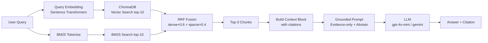

# Architecture — RAG Pipeline (Day 08 Lab)

## 1. Tổng quan kiến trúc

Hệ thống là **trợ lý nội bộ cho CS + IT Helpdesk**, trả lời câu hỏi về chính sách hoàn tiền, SLA ticket, quy trình cấp quyền, và FAQ bằng chứng cứ được retrieve từ 5 tài liệu nội bộ. Pipeline đảm bảo câu trả lời luôn grounded vào tài liệu thực tế, không hallucinate.

```
[Raw Docs (.txt)]
    ↓
[index.py: Preprocess → Chunk (section-based + paragraph) → Embed → Store]
    ↓
[ChromaDB Vector Store (cosine similarity)]
    ↓
[rag_answer.py: Query → Dense/Hybrid Retrieve → (Rerank) → Grounded Prompt → LLM]
    ↓
[Grounded Answer + Citation [1][2][3]]
    ↓
[eval.py: 4-metric Scorecard + A/B Comparison]
```

---

## 2. Indexing Pipeline (Sprint 1)

### Tài liệu được index
| File | Nguồn | Department | Số chunk |
|------|-------|-----------|---------|
| `policy_refund_v4.txt` | policy/refund-v4.pdf | CS | ~6 |
| `sla_p1_2026.txt` | support/sla-p1-2026.pdf | IT | ~5 |
| `access_control_sop.txt` | it/access-control-sop.md | IT Security | ~7 |
| `it_helpdesk_faq.txt` | support/helpdesk-faq.md | IT | ~6 |
| `hr_leave_policy.txt` | hr/leave-policy-2026.pdf | HR | ~5 |

### Quyết định chunking
| Tham số | Giá trị | Lý do |
|---------|---------|-------|
| Chunk size | 400 tokens (~1600 ký tự) | Đủ ngữ cảnh cho một điều khoản, không quá dài gây lost-in-the-middle |
| Overlap | 80 tokens (~320 ký tự) | Giữ ngữ cảnh liên tục giữa các chunk, tránh cắt giữa câu |
| Chunking strategy | Section-based → paragraph fallback | Ưu tiên ranh giới tự nhiên (heading `=== ... ===`), rồi mới split theo paragraph nếu section quá dài |
| Metadata fields | source, section, department, effective_date, access | Phục vụ filter, freshness check, citation |

**Lý do chọn section-based chunking:** Các tài liệu đều có cấu trúc heading rõ ràng (`=== Điều X ===`, `=== Section X ===`). Cắt theo section đảm bảo mỗi chunk chứa một điều khoản hoàn chỉnh, không bị cắt giữa quy định.

### Embedding model
- **Model**: `paraphrase-multilingual-MiniLM-L12-v2` (Sentence Transformers, local)
- **Lý do**: Hỗ trợ tiếng Việt tốt, chạy local không cần API key, phù hợp corpus nội bộ
- **Vector store**: ChromaDB (PersistentClient)
- **Similarity metric**: Cosine

---

## 3. Retrieval Pipeline (Sprint 2 + 3)

### Baseline (Sprint 2)
| Tham số | Giá trị |
|---------|---------|
| Strategy | Dense (embedding similarity) |
| Top-k search | 10 |
| Top-k select | 3 |
| Rerank | Không |

### Variant (Sprint 3) — Hybrid Retrieval
| Tham số | Giá trị | Thay đổi so với baseline |
|---------|---------|------------------------|
| Strategy | Hybrid (Dense + BM25 RRF) | Dense → Hybrid |
| Top-k search | 10 | Không đổi |
| Top-k select | 3 | Không đổi |
| Dense weight | 0.6 | Mới |
| Sparse weight | 0.4 | Mới |
| Rerank | Không | Không đổi |

**Lý do chọn Hybrid:**
Corpus có cả ngôn ngữ tự nhiên (chính sách, quy trình) lẫn tên riêng và mã kỹ thuật (`P1`, `Level 3`, `ERR-403`, `Approval Matrix`). Dense search tốt cho câu hỏi paraphrase nhưng bỏ lỡ exact keyword. BM25 bắt được exact term nhưng kém với câu hỏi ngữ nghĩa. Hybrid RRF kết hợp điểm mạnh của cả hai.

Ví dụ cụ thể: Query "Approval Matrix để cấp quyền" — tài liệu đổi tên thành "Access Control SOP". Dense có thể tìm được qua ngữ nghĩa, BM25 bắt được từ "Approval Matrix" trong ghi chú tài liệu.

---

## 4. Generation (Sprint 2)

### Grounded Prompt Template
```
Answer only from the retrieved context below.
If the context is insufficient to answer the question, explicitly state that
the information is not available in the provided documents. Do not make up information.
Cite the source field (in brackets like [1]) when possible.
Keep your answer short, clear, and factual.
Respond in the same language as the question.

Question: {query}

Context:
[1] {source} | {section} | score={score}
{chunk_text}

[2] ...

Answer:
```

### LLM Configuration
| Tham số | Giá trị |
|---------|---------|
| Model | gpt-4o-mini (OpenAI) hoặc gemini-1.5-flash (Gemini) |
| Temperature | 0 (output ổn định cho eval) |
| Max tokens | 512 |

**Abstain mechanism:** Prompt yêu cầu model nói rõ "thông tin không có trong tài liệu" thay vì bịa. Điều này quan trọng cho câu hỏi như ERR-403-AUTH (không có trong docs).

---

## 5. Evaluation (Sprint 4)

### 4 Metrics
| Metric | Đo gì | Cách chấm |
|--------|-------|-----------|
| Faithfulness | Answer có grounded vào retrieved context không? | LLM-as-Judge (1-5) |
| Answer Relevance | Answer có trả lời đúng câu hỏi không? | LLM-as-Judge (1-5) |
| Context Recall | Retriever có lấy đúng source cần thiết không? | Exact match (1-5) |
| Completeness | Answer có đủ thông tin so với expected không? | LLM-as-Judge (1-5) |

### LLM-as-Judge
`eval.py` implement LLM-as-Judge cho Faithfulness, Answer Relevance, và Completeness. Context Recall dùng exact source matching (deterministic).

---

## 6. Failure Mode Checklist

| Failure Mode | Triệu chứng | Cách kiểm tra |
|-------------|-------------|---------------|
| Index lỗi | Retrieve về docs cũ / sai version | `inspect_metadata_coverage()` trong index.py |
| Chunking tệ | Chunk cắt giữa điều khoản | `list_chunks()` và đọc text preview |
| Retrieval lỗi | Không tìm được expected source | `score_context_recall()` trong eval.py |
| Generation lỗi | Answer không grounded / bịa | `score_faithfulness()` trong eval.py |
| Token overload | Context quá dài → lost in the middle | Kiểm tra độ dài context_block |

---

## 7. Pipeline Diagram


